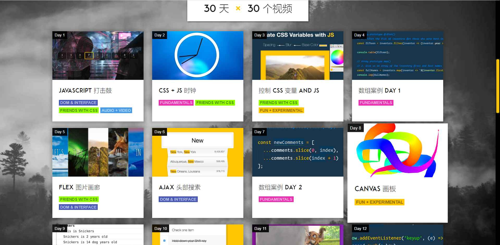

# 关于本项目
本项目是基于 Wes Bos 的 [JavaScript30](https://github.com/wesbos/JavaScript30)  的中文学习小组，相关中文资料存放在[语雀小组](https://www.yuque.com/javascript30)
JavaScript30 是一个非常棒的项目，很值得挑战和学习。在此感谢 [wes Bos](https://github.com/wesbos) 的分享，和 [Soyaine](https://github.com/soyaine) 提供的中文指南。

## JavaScript30是什么？

JavaScirpt30 是 [Wes Bos](https://github.com/wesbos/JavaScript30) 推出的一个 30 天挑战。项目免费提供了 30 个视频教程、30 个挑战的起始文档和 30 个挑战解决方案源代码。目的是帮助人们用纯 JavaScript 来写东西，不借助框架和库，也不使用编译器和引用。

## 对应文章和案例效果
| No   | Guide                                                        | Demo                                                         |
| ---- | ------------------------------------------------------------ | ------------------------------------------------------------ |
| 1    | [JavaScript Drum Kit  指南](https://github.com/soyaine/JavaScript30/tree/master/01%20-%20JavaScript%20Drum%20Kit) | [纯 JS 模拟敲鼓效果](http://soyaine.github.io/JavaScript30/01%20-%20JavaScript%20Drum%20Kit/index-SOYAINE.html) |
| 2    | [JS + CSS Clock 指南](https://github.com/soyaine/JavaScript30/tree/master/02%20-%20JS%20%2B%20CSS%20Clock) | [纯 JavaScript+CSS 时钟效果](http://soyaine.github.io/JavaScript30/02%20-%20JS%20%2B%20CSS%20Clock/index-SOYAINE.html) |
| 3    | [CSS Variables 指南](https://github.com/soyaine/JavaScript30/tree/master/03%20-%20CSS%20Variables) | [用 CSS 变量实现拖动控制参数效果](http://soyaine.github.io/JavaScript30/03%20-%20CSS%20Variables/index-SOYAINE.html) |
| 4    | [Array Cardio, Day 1 指南](https://github.com/soyaine/JavaScript30/tree/master/04%20-%20Array%20Cardio%20Day%201) | [数组基本操作方法示例一](http://soyaine.github.io/JavaScript30/04%20-%20Array%20Cardio%20Day%201/index-SOYAINE.html) |
| 5    | [Flex Panel Gallery 指南](https://github.com/soyaine/JavaScript30/blob/master/05%20-%20Flex%20Panel%20Gallery/README.md) | [可伸缩的图片墙在线效果](https://soyaine.github.io/JavaScript30/05%20-%20Flex%20Panel%20Gallery/index-SOYAINE2.html) |
| 6    | [Type Ahead 指南](https://github.com/soyaine/JavaScript30/blob/master/06%20-%20Type%20Ahead/README.md) | [根据关键词快速匹配诗句在线效果](https://soyaine.github.io/JavaScript30/06%20-%20Type%20Ahead/index-SOYAINE.html) |
| 7    | [Array Cardio, Day 2 指南](https://github.com/soyaine/JavaScript30/tree/master/07%20-%20Array%20Cardio%20Day%202) | [数组基本操作方法示例二](http://soyaine.github.io/JavaScript30/07%20-%20Array%20Cardio%20Day%202/index-SOYAINE.html) |
| 8    | [Fun with HTML5 Canvas 指南](https://github.com/soyaine/JavaScript30/tree/master/08%20-%20Fun%20with%20HTML5%20Canvas) | [彩虹画笔绘画板在线效果](https://soyaine.github.io/JavaScript30/08%20-%20Fun%20with%20HTML5%20Canvas/index-SOYAINE.html) |
| 9    | [Dev Tools Domination 指南](https://github.com/soyaine/JavaScript30/blob/master/09%20-%20Dev%20Tools%20Domination/README.md) | [Console 调试技巧在线示例](https://soyaine.github.io/JavaScript30/09%20-%20Dev%20Tools%20Domination/index-SOYAINE.html) |
| 10   | [Hold Shift and Check Checkboxes 指南](https://github.com/soyaine/JavaScript30/blob/master/10%20-%20Hold%20Shift%20and%20Check%20Checkboxes/README.md) | [Shift 批量选中在线效果](https://soyaine.github.io/JavaScript30/10%20-%20Hold%20Shift%20and%20Check%20Checkboxes/index-SOYAINE.html) |
| 11   | [Custom Video Player 指南](https://github.com/soyaine/JavaScript30/blob/master/11%20-%20Custom%20Video%20Player/README.md) | -                                                            |
| 12   | [Key Sequence Detection 指南](https://github.com/soyaine/JavaScript30/tree/master/12%20-%20Key%20Sequence%20Detection/README.md) | [在线效果](https://soyaine.github.io/JavaScript30/12%20-%20Key%20Sequence%20Detection/index-FINISHED.html) |
| 13   | [Slide in on Scroll 指南](https://github.com/soyaine/JavaScript30/blob/master/13%20-%20Slide%20in%20on%20Scroll/README.md) | [图片随屏幕滚动而滑入滑出的在线效果](https://soyaine.github.io/JavaScript30/13%20-%20Slide%20in%20on%20Scroll/index-SOYAINE.html) |
| 14   | [JavaScript References vs. Copying 指南](https://github.com/soyaine/JavaScript30/tree/master/14%20-%20JavaScript%20References%20VS%20Copying) | -                                                            |
| 15   | [LocalStorage](https://github.com/soyaine/JavaScript30/blob/master/15%20-%20LocalStorage/README.md) | [利用 localStorage 模拟在线菜单](https://soyaine.github.io/JavaScript30/15%20-%20LocalStorage/index-SOYAINE.html) |
| 16   | [Mouse Move Shadow 指南](https://github.com/soyaine/JavaScript30/blob/master/16%20-%20Mouse%20Move%20Shadow/README.md) | [文字阴影随鼠标移动在线效果](https://soyaine.github.io/JavaScript30/16%20-%20Mouse%20Move%20Shadow/index-finished-es5.html) |
| 17   | [Sort Without Articles 指南](https://github.com/soyaine/JavaScript30/blob/master/17%20-%20Sort%20Without%20Articles/README.md) | [去前缀排序在线效果](https://soyaine.github.io/JavaScript30/17%20-%20Sort%20Without%20Articles/index-finished-Dashrun-es5.html) |
| 18   | [Adding Up Times with Reduce 指南](https://github.com/soyaine/JavaScript30/tree/master/18%20-%20AddingUpTimesWithReduce) | [使用 Reduce 进行时间叠加效果](https://soyaine.github.io/JavaScript30/18%20-%20AddingUpTimesWithReduce/index-finished-Dashrun-es6.html) |
| 19   | [Webcam Fun 指南](https://github.com/soyaine/JavaScript30/blob/master/19%20-%20Webcam%20Fun/README.md) | [网络摄像头及图片处理在线效果](https://soyaine.github.io/JavaScript30/19%20-%20Webcam%20Fun/index-finished-Dashrun.html) |
| 20   | [Speech Detection指南](https://github.com/soyaine/JavaScript30/blob/master/20%20-%20Speech%20Detection/README.md) | [Speech Detection效果](https://soyaine.github.io/JavaScript30/20%20-%20Speech%20Detection/index-finished-Dashrun.html) |
| 21   | [Geolocation指南](https://github.com/soyaine/JavaScript30/blob/master/21%20-%20Geolocation/README.md) | [Geolocation效果](https://soyaine.github.io/JavaScript30/21%20-%20Geolocation/index-finished-Dashrun.html) |
| 22   | [Follow Along Link Highlighter指南](https://github.com/soyaine/JavaScript30/blob/master/22%20-%20Follow%20Along%20Link%20Highlighter/README.md) | [Follow Along Link Highlighter效果](https://soyaine.github.io/JavaScript30/22%20-%20Follow%20Along%20Link%20Highlighter/index-finished-Dashrun.html) |
| 23   | [Speech Synthesis指南](https://github.com/soyaine/JavaScript30/blob/master/23%20-%20Speech%20Synthesis/README.md) | [Speech Synthesis效果](https://soyaine.github.io/JavaScript30/23%20-%20Speech%20Synthesis/index-finished-Dashrun.html) |
| 24   | [Sticky Nav指南](https://github.com/soyaine/JavaScript30/blob/master/24%20-%20Sticky%20Nav/README.md) | [Sticky Nav效果](https://soyaine.github.io/JavaScript30/24%20-%20Sticky%20Nav/index-finished-Dashrun.html) |
| 25   | [Event Related指南](https://github.com/soyaine/JavaScript30/blob/master/25%20-%20Event%20Related/README.md) | [Event Related效果](https://soyaine.github.io/JavaScript30/25%20-%20Event%20Related/index-finished-Dashrun.html) |
| 26   | [Stripe Follow Along Nav指南](https://github.com/soyaine/JavaScript30/blob/master/26%20-%20Stripe%20Follow%20Along%20Nav/README.md) | [Strip Follow Along Nav效果](https://soyaine.github.io/JavaScript30/26%20-%20Stripe%20Follow%20Along%20Nav/index-finished-Dashrun.html) |
| 27   | [Click and Drag指南](https://github.com/soyaine/JavaScript30/blob/master/27%20-%20Click%20and%20Drag/README.md) | [Click and Drag效果](https://soyaine.github.io/JavaScript30/27%20-%20Click%20and%20Drag/index-finished-Dashrun.html) |
| 28   | [Video Speed Controller指南](https://github.com/soyaine/JavaScript30/blob/master/28%20-%20Video%20Speed%20Controller/README.md) | [Video Speed Controller效果](https://soyaine.github.io/JavaScript30/28%20-%20Video%20Speed%20Controller/index-finished-Dashrun.html) |
| 29   | Countdown Timer                                              | -                                                            |
| 30   | Whack A Mole                                                 | -                                                            |

## 语雀学习小组

搭配对应的[语雀小组](https://www.yuque.com/javascript30)，方便大家学习

