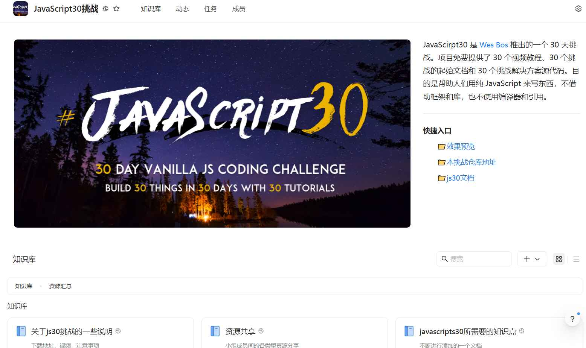
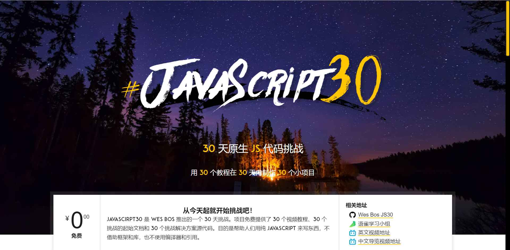
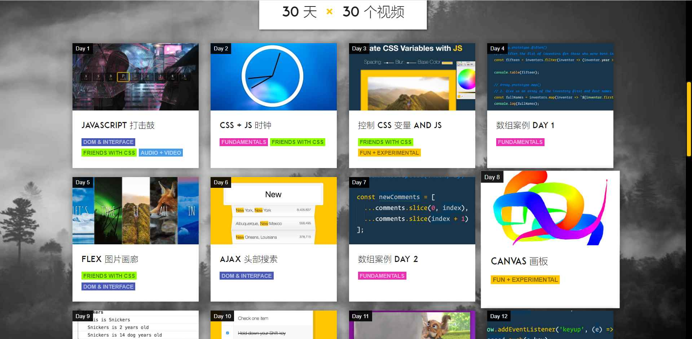

# JavaScript30项目预览
本项目是基于 [Wes Bos](https://github.com/wesbos/JavaScript30) JavaScript30 的中文指南，相关中文资料存放在[语雀小组](https://www.yuque.com/javascript30)

## JavaScript是什么？

JavaScirpt30 是 [Wes Bos](https://github.com/wesbos/JavaScript30) 推出的一个 30 天挑战。项目免费提供了 30 个视频教程、30 个挑战的起始文档和 30 个挑战解决方案源代码。目的是帮助人们用纯 JavaScript 来写东西，不借助框架和库，也不使用编译器和引用。

## 本项目的目的

JavaScript30项目预览，搭配对应的[语雀小组](https://www.yuque.com/javascript30)，方便大家学习

